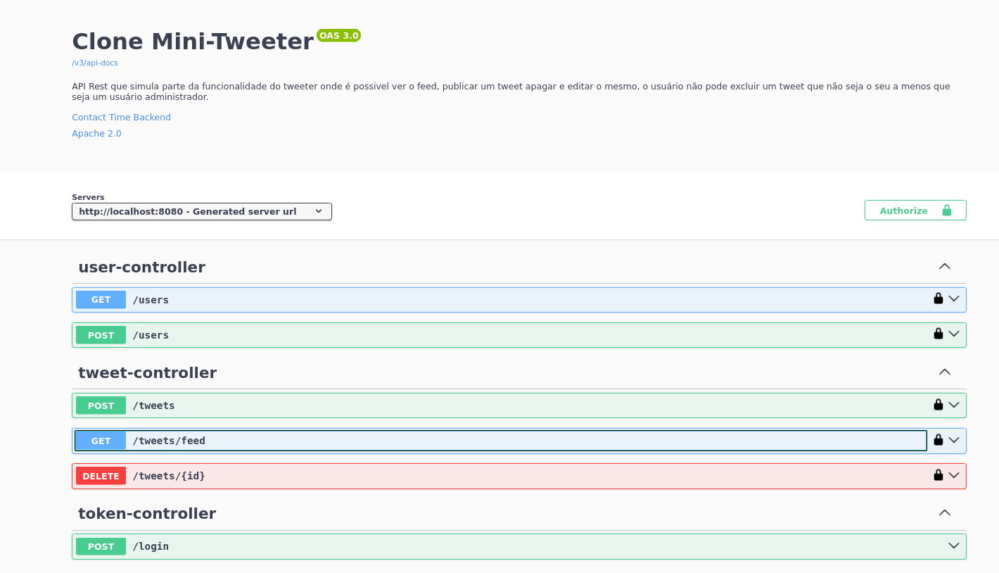
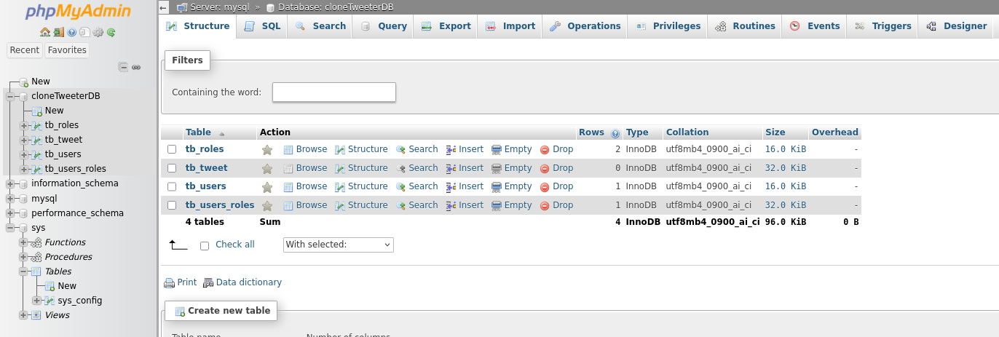

# Mini Tweeter

### Requisitos
- docker e docker-compose
- java versão 17

abra o terminal dentro do projeto
```
cd docker
docker-compose up -d
```
execute o projeto usando a idea, ou pelos comandos
```
gradle build
gradle run
```
### acesse o swagger

[Swagger - Tweeter Clone](http://localhost:8080/swagger-ui/index.html#/)



### caso queira acessar a base dados
[Banco de Dados Mysql](http://localhost:8082/index.php)
```
user: root
pass: root
```
